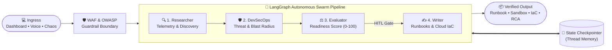

# 🤖 SwarmOps

> **Autonomous Site Reliability Engineering (SRE) & Multi-Agent Operations Command Center** powered by **FastAPI**, **LangGraph**, and **Next.js 16 (React + Tailwind CSS)**.


---

## 🌟 Architecture & Data Flow

**SwarmOps** coordinates specialized AI agents via a cyclic LangGraph state machine, hardened by an API security boundary, persistent checkpointer memory, and interactive execution sandboxes.



---


## ⚡ Master Features

### 1. 🐒 Chaos Engineering & Outage Simulator
- Trigger simulated production disasters with one click:
  - 💥 **Split-Brain Network Partition** (AZ-East vs AZ-West)
  - 🌊 **Ingress 85% SYN Flood** (Layer-7 DDoS mitigation)
  - 🪪 **Expired Wildcard Root CA** (Internal microservice mTLS failure)
  - 🛑 **Zombie DB I/O Freeze** (Transaction table lock deadlocks)
- Watch the 4-agent swarm respond in real time to anomaly telemetry.

### 2. 💬 Interrogate the Swarm (Direct Agent Q&A)
- Directly interview individual agents about their decisions:
  - `@Security`: Inquire about threat modeling, IAM boundaries, and risk ratings.
  - `@Researcher`: Ask about P99 latency baselines, replication lag, and cluster metrics.
  - `@Evaluator`: Review readiness score breakdowns (Reliability, Security, Rollback).
  - `@Writer`: Request syntax explanations, rollback contingencies, or manual overrides.
- Context-aware responses retrieved from LangGraph's checkpointer thread memory.

### 3. ☁️ Multi-Cloud Target & Infrastructure-as-Code (IaC) Exporter
- Export automated runbooks into verified infrastructure code:
  - 🟠 **AWS**: Route53 Failover Records, CloudWatch Alarms, RDS Aurora promotion.
  - 🔵 **Google Cloud**: Cloud SQL Standby promotion, Cloud DNS policies.
  - 🔷 **Azure**: Azure PostgreSQL flexible server failover, Traffic Manager routing.
- **Formats**: **Terraform** (`.tf`), **Ansible Playbook** (`.yml`), and **Production Shell Script** (`.sh` with strict `set -euo pipefail`).

### 4. 📉 Visual Topology & Pre/Post Architecture Diff
- **Pre vs Post Cutover Switcher**:
  - **Steady State (Pre-Incident)**: Normal traffic into primary DB with synchronous WAL replication streams.
  - **Failover Cutover (Post-Incident)**: Severed primary connection and re-routed proxy traffic to promoted secondary replicas.
- **Blast-Radius HUD**: Displays containment percentage, failover RTO (3.8s), transaction drop rates (0.00%), and WAL deltas.

### 5. 📊 Automated SRE Incident Post-Mortem & RCA Generator
- Automatically compiles formal Root Cause Analysis (RCA) documentation:
  - Mean Time to Resolution (MTTR) indicator.
  - Financial business impact calculation based on downtime SLA tiers.
  - The 5-Whys root cause analysis.
  - Incident timeline table and interactive Corrective and Preventive Actions (CAPA) checklist.
  - One-click export to Markdown (`post-mortem-RCA.md`).

### 6. 🛡️ DevSecOps & Anti-Hacking Guardrails
- **OWASP LLM01 Prompt Injection Defense**: Real-time pattern interception blocking instruction bypasses, credential dumps, and shell drops.
- **Thread ID Validation**: Path traversal and SQL injection regex boundary checks.
- **Sliding Window Rate Limiter**: 45 requests/minute per client IP.
- **Security Headers**: HSTS, CSP, X-Frame-Options, X-Content-Type-Options.

### 7. 🧪 Interactive Dry-Run Sandbox & Modern UI
- **Edge-to-Edge Design**: Responsive full-width dashboard with Dark Cyber and Clean Light themes.
- **Web Audio Synthesizer**: Custom frequency chimes for agent status transitions.
- **Web Speech API**: Voice mission input via browser microphone.
- **In-Browser Sandbox**: Execute simulated dry-run tests for generated `kubectl`, `aws`, and `psql` commands.

---

## 📁 Repository Structure

```text
multi-agent-ops-crew/
├── backend/
│   ├── app/
│   │   ├── __init__.py          # Package init
│   │   ├── config.py            # Pydantic environment configuration
│   │   ├── state.py             # OpsCrewState LangGraph TypedDict schema
│   │   ├── security.py          # OWASP LLM01 guardrails, rate limiting, sanitization
│   │   ├── agent_graph.py       # 5-node LangGraph StateGraph & checkpointer
│   │   └── main.py              # FastAPI endpoints (REST, SSE, Interrogate, IaC, RCA)
│   ├── .env.example             # Backend environment template
│   ├── Dockerfile               # Container definition
│   ├── requirements.txt         # Python dependencies
│   └── run_backend.sh           # Unix startup wrapper
├── frontend/
│   ├── src/
│   │   └── app/
│   │       ├── globals.css      # Custom adaptive styling & scrollbars
│   │       ├── layout.tsx       # Root Next.js layout & metadata
│   │       └── page.tsx         # Dashboard with 5 Upgrades & Swarm HUD
│   ├── .env.example             # Frontend environment template
│   ├── Dockerfile               # Node multi-stage build container
│   ├── next.config.js           # Next.js build config (Webpack + WASM SWC)
│   ├── package.json             # NPM dependencies & scripts
│   ├── postcss.config.js        # PostCSS config
│   ├── tailwind.config.js       # Tailwind CSS design system config
│   └── tsconfig.json            # TypeScript configuration
├── docker-compose.yml           # Multi-container orchestration
├── .gitignore                   # Ignored files (node_modules, venv, .env, db)
└── README.md                    # Project documentation
```

---

## 🚀 Quickstart Guide

### 1. Prerequisites
- Python 3.10+
- Node.js 18+ & npm
- (Optional) Docker & Docker Compose

### 2. Clone the Repository
```bash
git clone https://github.com/kailash6207/multi-agent-ops-crew.git
cd multi-agent-ops-crew
```

### 3. Backend Setup
```bash
cd backend
python -m venv venv
source venv/bin/activate  # On Windows: venv\Scripts\activate
pip install -r requirements.txt
cp .env.example .env

# Run FastAPI server
uvicorn app.main:app --host 0.0.0.0 --port 8000 --reload
```

### 4. Frontend Setup
```bash
cd ../frontend
npm install
cp .env.example .env.local

# Run Next.js dashboard
npm run dev
```

Visit **`http://localhost:3000`** in your browser to launch the Ops Crew dashboard!

---

## 🧪 Testing & Verification

Run health and security status checks:
```bash
# Health probe
curl http://localhost:8000/health

# WAF & Security posture
curl http://localhost:8000/api/security-status

# Generate Multi-Cloud IaC
curl -X POST http://localhost:8000/api/generate-iac \
  -H "Content-Type: application/json" \
  -d '{"cloud": "AWS", "format": "terraform", "mission": "RDS Aurora Failover"}'
```

---

## 📜 License
MIT License. Created by [kailash6207](https://github.com/kailash6207).
